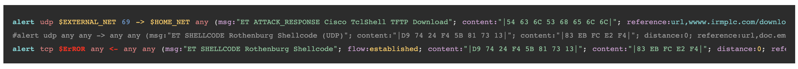

# suricata-webhighlight

This is an example for highlighting suricata-rules in your browser.

## Dependencies: 
- [prism](https://github.com/PrismJS/prism) - syntax-highlighting
- [misbehave](https://github.com/orbitbot/misbehave) - a lightweight editor